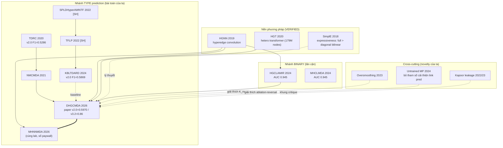

# Knowledge Map — MDA type prediction & DHGCMDA lineage (SESSION 4, 2026-07-05)

> Tổng hợp từ ledger (Cụm A + B/C + 2 bổ sung S4). **Chỉ bài VERIFIED** làm xương sống (13 bài).
> SEARCH-HIT ghi rõ nhãn `[SH]`. Số liệu đều là quote đã fetch (xem `ledger.md`).

---

## 1. XƯƠNG SỐNG VERIFIED (13 bài)

| # | Bài | Năm | Venue | Nhánh | Loại dự đoán |
|---|---|---|---|---|---|
| A1 | DHGCMDA | 2026 | BMC Bioinformatics | hypergraph+CL+HGT (neural) | **type** |
| A4 | MHNNMDA | 2026 | J Comput-Aided Mol Des | multi-stage hypergraph (neural) | **type** |
| A2 | NMCMDA | 2021 | Briefings in Bioinf | RGCN encoder+neural decoder | **type** (multi-category) |
| A3 | TDRC | 2020 | Briefings in Bioinf | tensor + relational constraint | **type** |
| S4-K | KBLTDARD | 2024 | PLOS Comput Biol | kernel Bayesian logistic tensor | **type** |
| A6 | HGCLAMIR | 2024 | PLOS Comput Biol | hypergraph+CL+attention | binary |
| A5 | MHCLMDA | 2024 | Briefings in Bioinf | multihypergraph+CL | binary |
| B1 | HGNN | 2019 | AAAI | hypergraph convolution (nền) | — |
| B2 | HGT | 2020 | WWW | heterogeneous transformer (nền) | — |
| B3 | SimplE | 2018 | NeurIPS | link-predictor expressiveness (nền) | — |
| C1 | Oversmoothing survey | 2023 | arXiv (Rusch/Bronstein) | meta-GNN | — |
| C2 | Kapoor–Narayanan leakage | 2022/23 | arXiv / Patterns (Cell) | meta-reproducibility | — |
| S4-U | Untrained Message Passing | 2024 | arXiv (Scholtes) | meta-simplification | binary/link |

---

## 2. DÒNG THỜI GIAN (nền → nhánh MDA)

```
2018  SimplE (expressiveness link predictor)
2019  HGNN (hyperedge convolution)
2020  HGT (heterogeneous transformer, web-scale)   │  TDRC (tensor+relational) ── mở màn nhánh TYPE
2021                                                 │  NMCMDA (neural multi-category)
2022  Kapoor–Narayanan (leakage crisis)             │  SPLDHyperAWNTF [SH], TFLP [SH] (tensor)
2023  Oversmoothing survey (Rusch/Bronstein)        │
2024  Untrained MP (Scholtes) │ HGCLAMIR, MHCLMDA   │  KBLTDARD (tensor SOTA reproducible)
      (binary hypergraph+CL)                         │
2026                                                 │  DHGCMDA, MHNNMDA  ← cùng lab (Sun/Shang/Liu)
```

## 3. SƠ ĐỒ QUAN HỆ (mermaid)



## 4. BẢNG `NHÁNH → SOTA → GAP`

| Nhánh | Bài đại diện (VERIFIED) | SOTA number (quote nguyên văn) | Gap / open problem |
|---|---|---|---|
| **Tensor type-pred** | KBLTDARD 2024 | v2.0 Top-1 **F1=0.5869** (P=0.6361,R=0.5665); v3.2 **F1=0.5197** | Trần tensor ~0.52–0.59 trên public data; không mô hình hoá high-order phi tuyến |
| **Neural type-pred** | DHGCMDA 2026 | paper v2.0 **F1=0.5970**, v3.2 **F1=0.8600** (P=0.7915,R=0.9421) | **v3.2 0.86 KHÔNG tái hiện** (thiếu curated 411×271); v2.0 chỉ ngang tensor |
| **↳ reproduce của ta** | (repo này) | v2.0 **F1=0.688±0.011** (full_bilinear+K=3); v3.2 ≈0.33 | vượt mọi public baseline trên v2.0; v3.2 vẫn gap |
| **Binary MDA** | HGCLAMIR / MHCLMDA 2024 | AUC≈**0.945**, AUPR≈0.945, F1≈0.87 | bão hoà; không phân biệt *type*; case-study top-50 ~49/50 |
| **Nền hypergraph** | HGNN 2019 | (không cùng thang) | over-smoothing khi dày; K-sensitivity chưa nghiên cứu cho MDA [SH] |
| **Nền transformer** | HGT 2020 | +9–21% (web-scale) | quy mô lệch 5–6 bậc so với MDA → nghi over-kill |
| **Meta / reproducibility** | Kapoor 2022/23 | 329 papers/17 fields; 8 loại leakage | chưa ai audit dòng DHGCMDA type-pred |

## 5. BA QUAN SÁT HỆ THỐNG (nổi lên từ map)

**O1 — Hai dòng phương pháp song song, hội tụ cùng bài toán.**
Tensor (TDRC→SPLDHyperAWNTF→TFLP→KBLTDARD) và Neural (NMCMDA→DHGCMDA/MHNNMDA). Trên **public v2.0**, cả hai kẹt ~0.52–0.60 Top-1 F1. Chỉ số v3.2=0.86 của DHGCMDA là **ngoại lệ đơn độc** — không dòng nào khác đạt gần, và ta không tái hiện được → nghi phụ thuộc data curation ẩn.

**O2 — Số baseline KHÔNG nhất quán, có hệ thống** (bằng chứng cứng cho angle A):
| Baseline | Số own-paper (v2.0 Top-1 F1) | Số trong bảng DHGCMDA |
|---|---|---|
| TDRC | 0.5286 | 0.4801 |
| KBLTDARD | 0.5869 | 0.5683 |
| NMCMDA | 0.4617 (MCD-6, khác data) | 0.5716 |
→ Mỗi paper re-run baseline trên split/curation riêng ra số **khác hẳn**. Không có benchmark chuẩn cho MDA type-pred. Đây là instance cụ thể của "lack of standard train-test split" (Kapoor).

**O3 — "Đơn giản hoá lại thắng" xuất hiện ở nhiều tầng** (bằng chứng cho angle B):
- Untrained MP 2024 (VERIFIED): *"untrained message passing layers can lead to competitive and even superior performance compared to fully trained MPNNs"*.
- Oversmoothing 2023 (VERIFIED): dày/sâu → embedding đồng nhất.
- Reproduce của ta: bỏ HGCN/HGT/CL đều +8–11%; K_neigs=3 (thưa) thắng K=13.
→ hội tụ: **DHGCMDA over-parameterized cho MDA nhỏ/thưa**; "right-sizing" là câu chuyện có nền literature.

---

## 6. OPEN GAPS (đầu vào cho Session 5 — novelty)

| ID | Gap | Bằng chứng literature | Ứng viên |
|---|---|---|---|
| G1 | Chưa có reproducibility/critique study cho dòng DHGCMDA type-pred | Kapoor (khung); chưa thấy bài audit riêng | **A** |
| G2 | K-sensitivity + over-parameterization của hypergraph GNN cho MDA thưa chưa ai làm | Oversmoothing, Untrained MP, K-sens [SH] | **B** |
| G3 | Không có benchmark chuẩn hoá multi-type MDA (curation/split khác nhau mọi paper) | O2 (số baseline lệch), data-leakage biomedical [SH] | A/C |
| G4 | Predictor faithfulness (diagonal vs full bilinear) chưa ablate trong MDA | SimplE, DistMult expressiveness [SH] | A/B |
| G5 | v3.2 type-pred có thật sự đạt 0.86 không có curated data? | reproduce ta 0.33; không dòng nào khác gần 0.86 | A |
| G6 | Metric-implementation bug (hardcode #types) — released-code eval bug | Kapoor taxonomy 8 loại | A |
| G7 | Uncertainty/calibration cho type prediction — trống hoàn toàn | (chưa thấy bài nào) | C (đột phá) |

**Lưu ý R7 (Session 5):** mỗi gap trên phải chạy ≥3 truy vấn phủ định "đã ai làm X chưa" trước khi gọi là NOVEL. Hiện mới là "chưa thấy trong 13 bài", CHƯA đủ để khẳng định.

---

## 7. Provenance & Limitations
- **SEARCH-HIT chưa nâng VERIFIED** (không dùng làm số cứng): TFLP & SPLDHyperAWNTF (tồn tại xác nhận qua GitHub/OUP/PMC nhưng số Top-1 chưa fetch riêng); K-sensitivity; DistMult-diagonal-symmetric; data-leakage biomedical (bioRxiv chặn bot).
- Số KBLTDARD "6.87%/6.79%/6.57% vs SPLDHyperAWNTF" = quote từ PMC (fetched) → VERIFIED.
- MHNNMDA số liệu vẫn paywall → chỉ đặt vị trí trên map, không so số.
- Map này KHÔNG dùng bất kỳ bài LOẠI (GRENADE) nào.
- Chưa đọc phần Method PDF DHGCMDA (K_neigs default, định nghĩa CV_type/CV_triplet) — nên đối chiếu ở Session 5/6 nếu cần định vị chính xác đóng góp.
- 13 bài là *đủ để định vị*, KHÔNG phải khảo sát vét cạn; nhánh binary MDA còn nhiều bài chưa duyệt (DGNMDA, CLHGNNMDA, AMFCL, HGSMDA — SEARCH-HIT Cụm A) — chỉ fetch nếu Session 5/6 cần.
